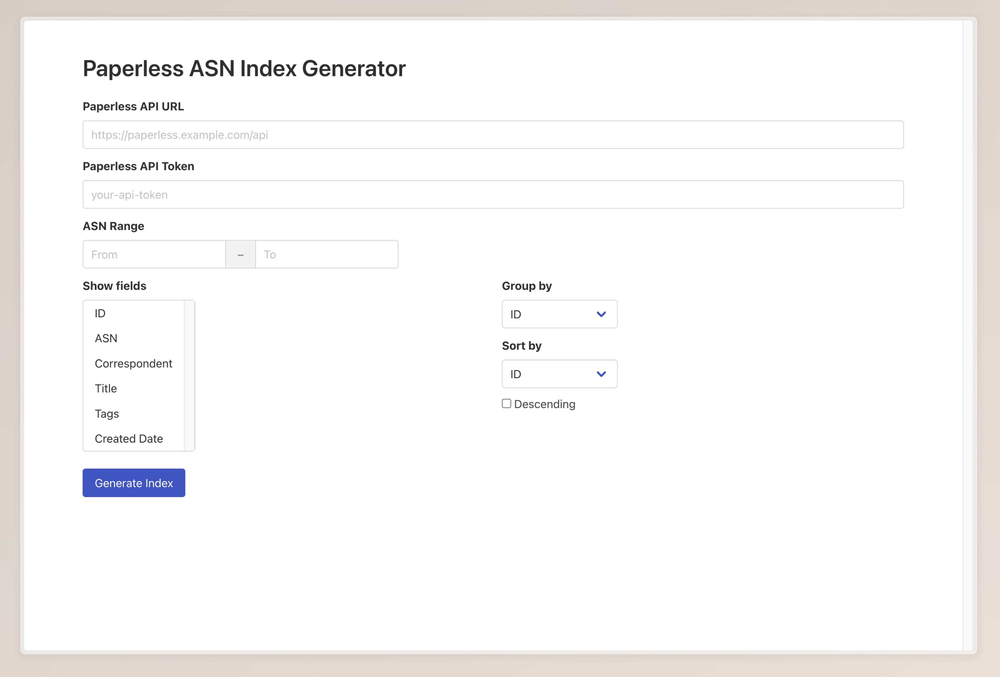
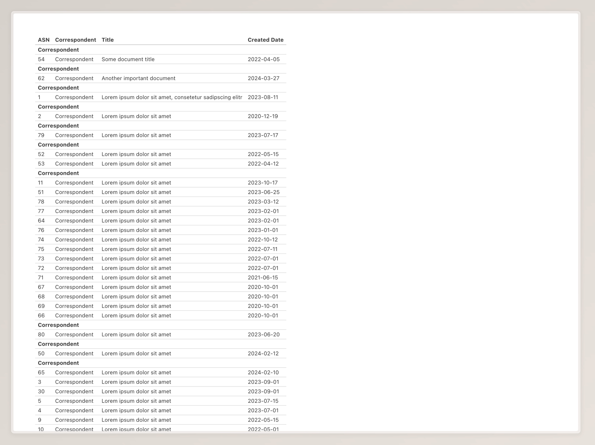

# paperless-asn-index

A simple web app that allows the user to generate a printable document index with ASN numbers from documents in a [Paperless-ngx](https://github.com/paperless-ngx/paperless-ngx) instance. To achieve this, the app uses the Paperless-ngx API. This can be useful when filing documents in a folder sorted by ASN numbers. A printed index can provide reference for finding documents in case of any technical problems with the corresponding Paperless-ngx instance.



The tool allows selecting fields to be shown as columns in the output. An ASN range can be chosen. The documents in that range can then be grouped by a field and sorted by another field inside the groups. For example, the user could group the documents by correspondent and then sort the documents of each correspondent by date.



This is an example of how the output could look like. This table can then be printed by using a browser's built-in printing functionality.

## Usage

### Rust

If you have the Rust compiler installed on your system, you can simply clone this repository and run `cargo build` to obtain an executable which can be used to locally run the web app on your system.

### Docker

You can use the provided Docker image to run the web app inside a Docker container.

```
docker run -d --name paperless-asn-index -p 8080:8080 ghcr.io/lxndio/paperless-asn-index:latest
```

## Warning

This application is in an early stage of development and is provided “as is” without any warranty under the terms of the attached license.
